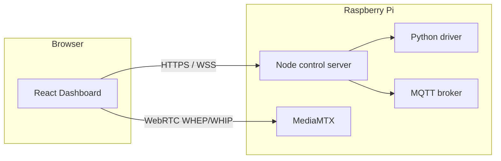

# Mango Rover

A remotely operated rover built around a Raspberry Pi: live video and audio, low-latency driving and gimbal control, and a browser dashboard you can use from anywhere your Pi is reachable (including over **Tailscale**).

---

## Highlights

| Area | What you get |
|------|----------------|
| **Telepresence** | Live camera via **WebRTC** (WHEP), rover microphone to the dashboard, and optional talkback (WHIP) so you can hear and speak through the rover. |
| **Control** | **WebSocket** channel for drive and gimbal at ~60 Hz-style updates; on-screen **dual joysticks**, keyboard **WASD** + arrows, mouse look when fullscreen, and mobile touch gimbal. |
| **Camera** | **Night vision** (long exposure) toggle, **focus** modes, **resolution** presets up to high-res still **capture** (full sensor) with MediaMTX coordination. |
| **Voice** | **Speech-to-text** assistant that talks to your backend; compound commands and confirmations (see `useVoiceAssistant` + server voice routes). |
| **Status** | Live **HUD**: battery, charging inference, voltage, distance, CPU load/temp, Wi‑Fi signal, pan/tilt, throttle, laser state, odometry snapshot. |
| **Power & ops** | **Quiet drive** (default: slow steady motors) vs **boost drive** (full speed); **USB power** for peripherals, **docking** UI hooks, graceful **idle shutdown** to save power, manual **reboot/shutdown** signals to the host. |
| **Cloud link** | **MQTT** (e.g. HiveMQ) for operator auth, ESP heartbeat, remote wake/logging, and integration with auxiliary hardware. |
| **Telemetry** | Relay-based telemetry ingest/query over HTTP (offloads local SQLite writes on the Pi). |

---

## Architecture (simplified)



- **`dashboard/`** — Vite + React mission control UI (`/rover/` base path for GitHub Pages–style deploys).
- **`server/`** — Express HTTPS API, WebSocket control plane, MQTT client, telemetry, TTS, and proxies to camera/MediaMTX where configured.
- **`mediamtx.yml` + Docker** — Camera/mic/talk paths, WebRTC listener, optional HLS.
- **`driver/`** — Python bridge for motors, servos, sensors, and telemetry parsing.

For dashboard env vars, build commands, and deploy notes, see **[dashboard/README.md](dashboard/README.md)**.

---

## Repo layout

| Path | Role |
|------|------|
| `dashboard/` | Frontend: config, API client, WebRTC UI, MQTT session, joysticks, assistant panel, tests |
| `server/` | Backend: routes (control, system, camera, voice), services, WebSocket, Vitest suite |
| `driver/` | `RoverDriver.py`, `TelemetryMonitor.py`, odometry alignment |
| `docker-compose.yml` | MediaMTX + control server containers, volumes, certs |
| `mediamtx.yml` | Streams, WebRTC TLS, STUN/additional hosts |
| `.github/workflows/` | CI: `npm test` for server and dashboard |

---

## Quick start (developers)

```bash
# Dashboard (local UI)
cd dashboard
cp .env.example .env.local   # set VITE_PI_SERVER_IP, VITE_MQTT_HOST, etc.
npm install && npm run dev

# Control server (on the Pi / in container)
cd server
npm install && npm test      # optional: verify tests
# Production: see server env and TLS paths in server/src/config.js
```

---

## Tests & quality

- **Server:** Vitest + Supertest (`server/`, `npm test`).
- **Dashboard:** Vitest + React Testing Library (`dashboard/`, `npm test`).
- CI runs both on push/PR to `main` / `master`.

---

## License / credits

Project-specific licensing and attribution belong in this repo’s `LICENSE` if present. Hardware and cloud credentials (MQTT, TLS files, Tailscale names) should stay out of git—use `.env` and secrets on the device.
